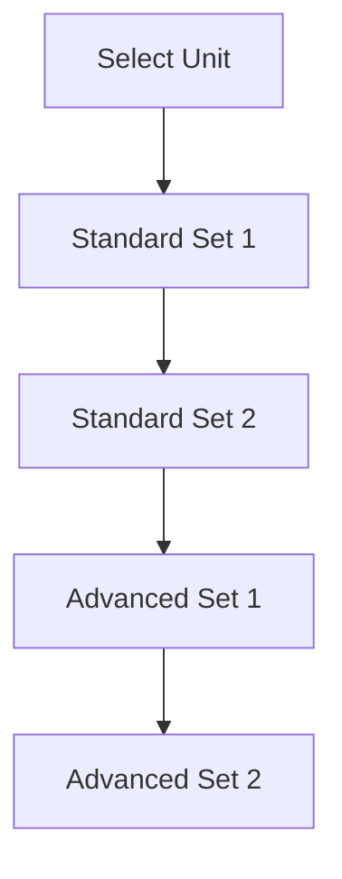

# TIP - Technical Interview Preparation

## Table of Contents

- [Description](#description)
- [UMPIRE + IOCE Methodology](#umpire--ioce-methodology)
- [Repository Structure](#repository-structure)
- [Problem Organization](#problem-organization)
- [How to Use This Repository](#how-to-use-this-repository)
- [Contribution Guidelines](#contribution-guidelines)
- [Credits](#credits)
- [License](#license)
- [Badges](#badges)
- [Features](#features)

---

## Description

A comprehensive technical interview preparation system using the UMPIRE problem-solving framework enhanced with IOCE analysis.

**Key Benefits:**

- Systematic approach to problem-solving
- Pattern recognition training
- Complexity analysis practice
- Real-world interview simulation

[↑ Back to Table of Contents](#table-of-contents)

---

## UMPIRE + IOCE Methodology

### 1. Understand (IOCE Framework)

- **Input**: Parameters and their constraints
- **Output**: Expected results format
- **Constraints**: Problem limitations
- **Examples**: Test cases including edge cases

### 2. Match

- Identify problem patterns
- Recall relevant algorithms
- Recognize similar problems

### 3. Plan

- Develop step-by-step approach
- Select optimal data structures
- Consider time/space tradeoffs

### 4. Implement

- Write clean, efficient code
- Use meaningful naming
- Include comments where needed

### 5. Review

- Verify against test cases
- Check edge conditions
- Validate assumptions

### 6. Evaluate

- Analyze time complexity
- Analyze space complexity
- Consider alternatives

[↑ Back to Table of Contents](#table-of-contents)

---

## Repository Structure

```
TIP_technical_interview_prep/
│
├── Unit_1_Strings_Arrays/
│   ├── Standard_Set_1/
│   │   ├── two_sum/
│   │   │   ├── problem.md
│   │   │   ├── solution.py
│   │   │   ├── test_cases.txt
│   │   │   └── analysis.md
│   │   └── ...
│   ├── Standard_Set_2/
│   ├── Advanced_Set_1/
│   └── Advanced_Set_2/
│
├── Unit_2_Dictionaries/
│   └── ... (same structure)
│
└── ... (all 12 units)
```

[↑ Back to Table of Contents](#table-of-contents)

---

## Problem Organization

### Core Curriculum

| Unit | Focus Area          | Key Concepts                     |
| ---- | ------------------- | -------------------------------- |
| 1    | Strings & Arrays    | Manipulation, searching, sorting |
| 2    | Dictionaries        | Hashing, frequency counting      |
| ...  | ...                 | ...                              |
| 12   | Dynamic Programming | Memoization, tabulation          |

### Problem Sets

- **Standard Set 1**: Foundational problems (15-20)
- **Standard Set 2**: Reinforcement problems (10-15)
- **Advanced Set 1**: Challenging applications (8-12)
- **Advanced Set 2**: Expert-level problems (5-8)

[↑ Back to Table of Contents](#table-of-contents)

---

## How to Use This Repository



1. **For Beginners**:

   - Start with Standard Set 1
   - Focus on understanding patterns

2. **For Intermediate**:

   - Complete Standard Sets
   - Time your solutions

3. **For Advanced**:
   - Focus on Advanced Sets
   - Optimize solutions

[↑ Back to Table of Contents](#table-of-contents)

---

## Contribution Guidelines

**Problem Submission Template:**

````markdown
### Problem Title

**Difficulty**: [Easy/Medium/Hard]

**IOCE**:

- Input:
- Output:
- Constraints:
- Examples:

**Solution**:

```python
def solution(params):
    # Implementation
```
````

**Complexity**:

- Time: O()
- Space: O()

1. Fork the repository
2. Create a feature branch
3. Add well-documented problems
4. Submit pull request

[↑ Back to Table of Contents](#table-of-contents)

---

## Credits

Curriculum and methodology adapted from [CodePath's TIP Course](https://www.codepath.org/courses/tech-interview-prep).

Special thanks to the CodePath team for developing the UMPIRE framework and making their materials available.

[↑ Back to Table of Contents](#table-of-contents)

---

## License

[MIT License](https://choosealicense.com/licenses/mit/) © 2025 Technical Interview Prep

[↑ Back to Table of Contents](#table-of-contents)

---

## Badges


[↑ Back to Table of Contents](#table-of-contents)

---

## Features

- **Structured Learning Path**: 12-unit progression
- **Multiple Problem Sets**: 4 sets per unit
- **Detailed Solutions**: With complexity analysis
- **Interview-Ready**: Timed practice recommendations
- **Comprehensive Coverage**: 500+ problems

[↑ Back to Table of Contents](#table-of-contents)
